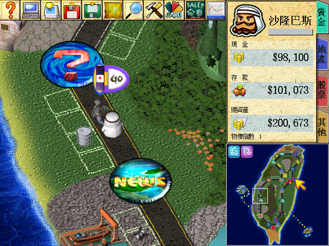
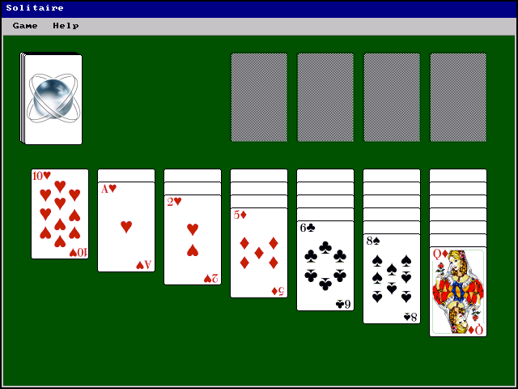
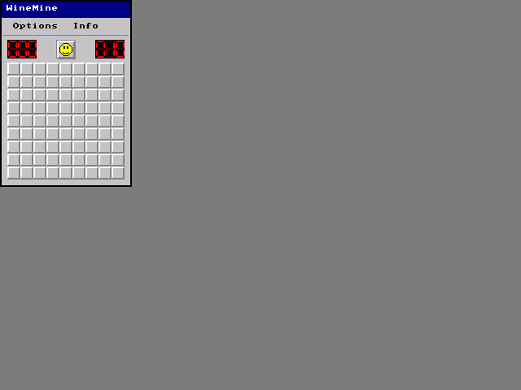
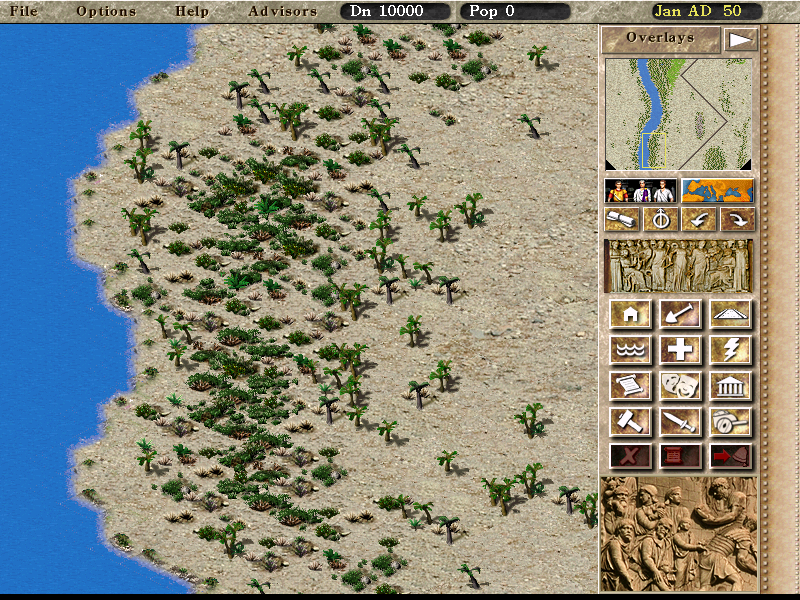
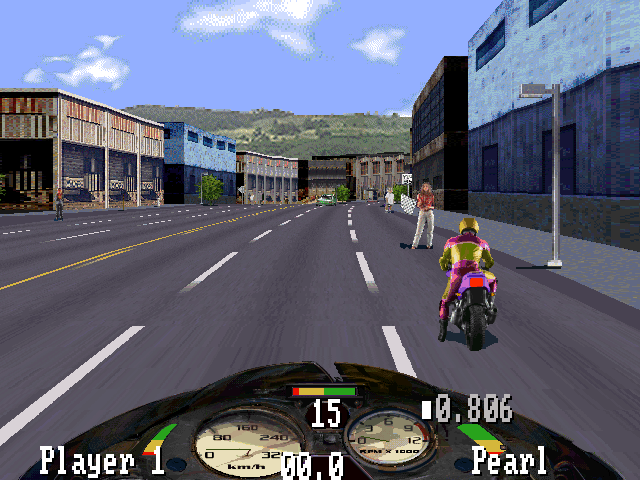
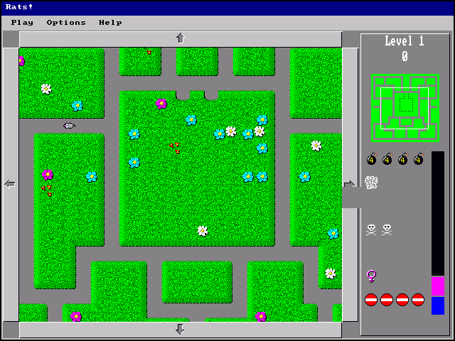

<div align="center">

# wemu

**An experimental 32-bit Win32 HLE emulator for classic Windows games.**

[](https://www.rust-lang.org/)
[](#building)
[](#status)

</div>

## Try it Now

Play in your browser at **[wemu.dev](https://wemu.dev)**.

The web frontend supports desktop browsers and mobile Safari, including
**iOS and iPadOS**. Open the site, choose a supported ZIP archive, and run it
without installing a native app.

## About

wemu is a high-level Win32 API emulator focused on old 32-bit Windows games.
It loads PE executables directly, maps guest memory into the host address space,
and implements the small practical subset of x86, USER/GDI, Kernel32, WinMM,
DirectDraw, and runtime APIs needed by real games.

The project is not a Wine replacement. It is a compact compatibility runtime
with deterministic headless output, SDL2 live play, and a browser frontend for
ZIP-mounted games.

## Status

wemu is under active development. It is useful for trying classic 32-bit
Windows games in the browser, on iOS/iPadOS, or through the SDL2 frontend, but
it is not yet a general-purpose Windows emulator.

Current priorities:

1. Improve compatibility for more old Windows games.
2. Make live play smoother across browser, iOS/iPadOS, and SDL2.
3. Improve Win32 UI behavior, including messages, timers, dialogs, menus, and controls.
4. Improve GDI and DirectDraw rendering correctness.

Current limitations:

- Game compatibility is still incomplete; missing x86 instructions or Win32 APIs are expected.
- Sound output is not implemented yet.

Non-goals for now:

- Kernel drivers
- 16-bit Windows applications

## Screenshots

| Rich4 | Solitaire | WineMine |
| --- | --- | --- |
|  |  |  |

| Caesar 3 | Road Rash | Rats |
| --- | --- | --- |
|  |  |  |

## Optimized for WASM

wemu is designed to run old 32-bit Windows games efficiently in WebAssembly,
with the browser as a first-class target.

Different projects choose different compatibility layers:

- [v86](https://github.com/copy/v86) emulates an x86 PC and hardware in the browser.
- [BoxedWine](https://github.com/danoon2/Boxedwine) runs 32-bit Wine and emulates the Linux kernel and CPU.
- wemu skips the guest OS, kernel, and hardware layers, and implements the Win32 APIs old games need directly in Rust and WASM.

This trades broad system compatibility for a smaller runtime and a shorter path
from Win32 game code to browser graphics, including desktop browsers and mobile
Safari on iOS/iPadOS.

- Native Win32 HLE for common Kernel32, USER, GDI, WinMM, DirectDraw, CRT, and COM calls.
- GDI and DirectDraw calls run as host-side HLE code, avoiding a full guest Windows graphics stack for common 2D game paths.
- Fastmem-style guest memory: guest addresses are directly usable inside a reserved host or wasm address range.
- No SoftMMU on the hot memory path. Normal guest loads and stores avoid per-access page-table dispatch, which removes a large source of emulator overhead.
- A compact Rust and wasm runtime instead of bundling a full Wine environment.

## Features

- 32-bit PE loading with import resolution and mounted drive paths.
- i386 CPU interpreter for the user-space subset needed by target games.
- USER/GDI, Kernel32, WinMM, DirectDraw, CRT, and COM HLE coverage for common game paths.
- DirectDraw primary presentation as the live frame boundary.
- SDL2 live frontend, browser frontend, and Node wasm runner.

## Building

Install a recent Rust toolchain. SDL2 builds also need SDL2 development
libraries installed on the host.

```bash
cargo build
cargo build --release
cargo build --release --features sdl2
```

Build the browser wasm artifact:

```bash
./build-wasm-release.sh
```

This copies:

```text
target/wasm32-unknown-unknown/release/wemu.wasm -> web/wemu.wasm
```

## Running

The native CLI has no subcommands. Mount host directories as guest drives and
pass a guest executable path in `--cmdline`.

```bash
cargo run --release --features sdl2 -- \
  --mount C:=/path/to/game \
  --cmdline 'C:\GAME.EXE' \
  --frontend sdl2
```

Native CLI can also mount a browser-style game ZIP directly. ZIP contents are
exposed under `C:\mnt`, matching the web frontend. If the archive has exactly
one `.exe`, `--cmdline` may be omitted; otherwise pass the guest executable path
shown in the error message.

```bash
cargo run --release -- \
  --zip /path/to/game.zip
```


## Web Frontend

Build wasm first:

```bash
./build-wasm-release.sh
```

Then serve the `web/` directory with any static HTTP server:

```bash
python3 -m http.server --directory web 8000
```

Open:

```text
http://127.0.0.1:8000/
```

The browser frontend loads `./wemu.wasm` from `web/` and supports virtual ZIP
mounting for game archives.

## Node Wasm Runner

The Node runner exercises the wasm API without a browser:

```bash
node tools/wemu-node.mjs \
  --wasm web/wemu.wasm \
  --exe /path/to/game/GAME.EXE \
  --guest-exe 'C:\GAME.EXE' \
  --mount C=/path/to/game \
  --max-insns 1000000 \
  --screenshot tmp/wasm-game.png
```

Use this for wasm regressions before debugging browser DOM behavior.

## Testing

Fast checks:

```bash
cargo check
cargo test
python3 tools/verify_hle_abi.py
cargo check --features sdl2
cargo check --release --target wasm32-unknown-unknown
./build-wasm-release.sh
node --check web/wemu.js
node --check tools/wemu-node.mjs
```


## Compatibility Reports

Useful reports include:

- Game title, version, and language
- Exact command line
- Host OS and build target
- Screenshot or short replay
- Last printed stop reason and instruction count
- Missing HLE report, crash report, or console output

Keep reports focused on reusable Win32 behavior. Avoid game-specific hacks when
describing or fixing compatibility issues.

## Credits

wemu references several open source projects and public interfaces to validate
Win32 behavior and x86 instruction semantics:

- [MinGW-w64 headers](https://www.mingw-w64.org/) for Win32 API prototypes,
  constants, and ABI details.
- [Wine](https://www.winehq.org/) for Win32 API behavior and compatibility
  research.
- [FEX](https://github.com/FEX-Emu/FEX) for x86 instruction behavior and
  emulator implementation references.
- [tiny386](https://github.com/hchunhui/tiny386) for learning and validating
  386 instruction behavior.

## Legal

wemu does not include games, copyrighted game data, Windows system files, or
runtime DLLs. Use only software and media that you are legally allowed to run.

Windows is a trademark of Microsoft Corporation. wemu is not affiliated with,
endorsed by, or sponsored by Microsoft.
